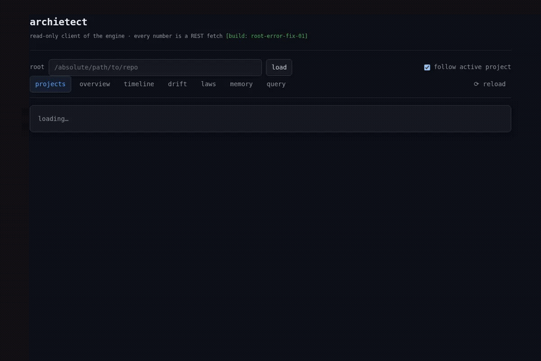

# archietect

**A deterministic, evidence-backed memory of what a codebase is — shared
across every project on the machine, not rebuilt from scratch per session.**

[](https://github.com/Neville777/Archietect/actions/workflows/ci.yml)
[](https://crates.io/crates/archietect)
[](LICENSE)
[](Cargo.toml)

A deterministic engine that maintains a living record of what a project's
concepts ARE — what exists, what is canonical, who uses it, why it is shaped
this way, and how that has changed over time — behind an explicit permission
boundary controlling what it's even allowed to look at, and a registry that
knows about every project it's been pointed at on the machine, not just the
one open right now. AI agents, editors, CI, and humans all query the same
continuously maintained state instead of each reconstructing a partial,
inconsistent understanding per session.

**Archietect does not use AI. AI uses Archietect.**

```
              Human
                │
      Claude / GPT / Cursor / Zed        ← intelligence lives HERE
                │
          Archietect (CLI / REST / MCP)
                │
     ┌──────────┴───────────┐
     ▼                       ▼
Architectural state    System registry
   (per project)      (every project this
laws · concepts ·      machine knows about
decisions · aliases   — which one, and when
evidence · history     an AI last touched it)
     │
source code · schemas · ADRs
```

## Quickstart

```bash
curl -fsSL https://raw.githubusercontent.com/Neville777/Archietect/main/packaging/install.sh | sh
```

Already have a Rust toolchain? `cargo install archietect` works too — just
without the install script's one extra step of auto-registering with
Claude Code/Gemini CLI (see [Installation](#installation) for that one
command, if you want it).

```bash
cd /path/to/your-project
archietect
```

That's it. The first run there indexes the project on the spot (creates
`archietect.db`, no separate `init` step); every run after that is
incremental. What you get back is a git-status-style glance at what it
found. From there:

```bash
archietect concept <name>   # does this already exist? where? how confident?
archietect gui               # the same thing in a browser — no commands to remember
```

Windows, building from source, and the native desktop app: see
[Installation](#installation). Every other command: see
[Usage](#usage).

## Demo



The GUI (`archietect gui` or the desktop app, Installation Option D below)
is a thin, read-only client of the same REST API the CLI and MCP server
answer from.

```
$ archietect concept doctor
{
  "concept": "doctor",
  "verdict": "STRUCTURAL",
  "canonical": "doctor",
  "confidence": "high — found in source as a real symbol, not a declared data/schema model",
  "evidence": [
    { "tier": "Declared", "what": "Function declared in src/query.rs:677" }
  ],
  "source": [{
    "file": "src/query.rs", "line": 677,
    "excerpt": "675: \n676: /// Repository summary for someone who just cloned it.\n677: pub fn doctor(idx: &Index, ...) -> Value {\n678:     // Domains = where declarations LIVE ..."
  }],
  "routes": [],
  "recommendation": "'doctor' exists in source but is not a schema/storage concept (it's a function, class, route, or similar). Schema-concept ranking does not apply."
}
```
(the line number above will drift as this file is edited — re-run it
yourself any time; it's live, not a fixture)

Real file, real line, real code excerpt, read fresh off disk at query time —
that's Archietect answering a question about its own source. Ask about
something that doesn't exist and it says so, at the same confidence, instead
of guessing:

```
$ archietect concept PaymentRefundService
{ "verdict": "ABSENT", "confidence": "high — no declaration, no observed usage, no name resemblance",
  "recommendation": "Genuinely new for this project. Building it is justified." }
```

And when a repo contains a language Archietect can't see into, it names that
gap instead of guessing past it:

```
$ archietect concept processOrder
{ "verdict": "INSUFFICIENT_COVERAGE",
  "confidence": "unknown — this repository contains files in a language with no structural extractor",
  "next_action": { "read": ["handler.lua"], "question": "Do any of these files implement or represent 'processOrder'?" } }
```

Every answer is one of exactly three things — **KNOWN** (a real answer, with
evidence), **KNOWN ABSENT** (searched everywhere it can see, genuinely isn't
there), or **INSUFFICIENT_COVERAGE** (a real blind spot, named honestly,
never silently guessed past). That's the entire trust model.

## Features

- **Evidence-tiered, never invented** — every answer is ranked `DECLARED`
  (the project's own schema asserts it) > `USED` (code observably touches
  it) > `NAMED` (name resemblance only — verdict `UNKNOWN`, needs a human).
- **Read-only against your code** — Archietect flags problems with evidence
  and stops; it never edits your working tree. The one exception (the
  proposal protocol, below) applies a patch a human explicitly accepted,
  uncommitted.
- **Fully offline and deterministic** — no AI inside, no API key, no
  network call. Intelligence stays in the client (Claude, GPT, Cursor, Zed).
- **Regression-tested against real repositories**, not just synthetic
  fixtures — see [Testing](#testing).
- **Append-only architectural history** — concept, alias, and decision
  changes are recorded as they happen and never rewritten.
- **Explicit blind spots** — a language with no structural extractor returns
  `INSUFFICIENT_COVERAGE`, never a false `ABSENT`, and names exactly which
  files a human or AI should read to check.
- **Three transports, one engine** — CLI, REST, and MCP all call the same
  query functions; no business logic lives in any one transport.

**Tech stack:** Rust, SQLite (`rusqlite`, bundled — no external DB to run),
regex-based structural/schema extraction, `tiny_http` for REST, stdio for MCP.

**Query latency:** read-only commands (`concept`, `impact`, `claim`, `doctor`, etc.) load the persisted index directly from SQLite — **~55ms** on a 637MB / 30k-file repository. No filesystem scan on every call; `archietect init` or `--refresh` to force a fresh scan.

**Context efficiency:** `archietect doctor` reports a `context_efficiency` block computed from your own index — the median source bytes an agent would read to explore a concept vs the JSON receipt Archietect returns. On real repositories this is consistently **98–99%** discovery payload reduction. Run it yourself to see your number, not ours:

```bash
archietect doctor | jq '.context_efficiency'
# {
#   "median_candidate_files_bytes": 65032,
#   "median_candidate_files_tokens_est": 16258,
#   "avg_query_payload_bytes": 782,
#   "avg_query_tokens_est": 195,
#   "discovery_payload_reduction": "98.8%",
#   ...
# }
```

**Real, reproducible benchmark:** [archietect vs. Agent Memory Engine](benchmarks/vs-agent-memory-engine/) —
15/15 vs 5/15 on surfacing a concept's real declaring file, across 3 public
repos already in `validation/`. Every number is reproducible from a script
in that directory; limitations are stated there too.

## Structural coverage

| Language | Symbols | Frameworks (routes) |
|---|---|---|
| Rust | structs, enums, traits, top-level functions (AST-verified via `syn`; falls back to lexical extraction if the file doesn't parse) | Axum, Actix-web, Rocket |
| Python | classes, top-level functions | FastAPI, Flask, Django |
| TypeScript/JavaScript | classes, interfaces, type aliases, enums, exported and unexported-PascalCase functions, events | Express, NestJS, Next.js, Nuxt (server API), Angular (router) |
| Vue | the SFC itself as a component, plus its `<script>` block | Nuxt (pages) |
| Go | exported structs, interfaces, functions/methods | — |
| Java/Kotlin | classes, interfaces, Kotlin top-level functions | Spring MVC |
| Ruby | classes, modules, methods | Rails |
| Elixir | modules, public functions | Phoenix |
| PHP | classes, interfaces, top-level functions | — |
| C# | public classes/interfaces/records, public methods | ASP.NET Core |
| Swift | classes, structs, protocols, top-level functions | Vapor |
| Objective-C | `@interface`/`@implementation`, `@protocol`, methods | — |
| C/C++ | structs, functions; classes for `.cpp`/`.hpp` only | — |
| Scala | classes, objects, traits, top-level `def` | — |
| Dart | classes, top-level functions | — |
| Haskell | `data`/`newtype`, typeclasses, top-level signatures | Yesod (`parseRoutes` quasi-quote only) |
| Clojure | public `defn`, `defrecord`/`deftype`, `defprotocol` | Compojure |
| GraphQL | types/interfaces/enums/inputs, named operations | — |
| Protocol Buffers | messages, services, rpc methods (as routes) | gRPC |
| GDScript | `class_name` declarations (falling back to the PascalCase filename for a script with none — most GDScript files attach to a node with no explicit `class_name`), top-level functions, signals | — |
| Godot Scene (`.tscn`) | the scene itself as a component (filename-keyed, same convention as GDScript's own fallback), plus its `ext_resource` dependencies (attached script, composed child scenes) as import edges resolved via Godot's own `res://` project-relative paths — a composed child scene's import also records which specific `[node ... instance=ExtResource(...)]` node(s) instance it | — |
| Godot Project Config (`project.godot`) | `[autoload]` global singleton registrations — the sole authoritative source of an autoload script's real name, since Godot 4 makes a `class_name` of the same name as an autoload a parse error, so those scripts deliberately have none | — |
| **Terraform** (`.tf`) | `resource`, `data`, and `module` blocks as named symbols (`aws_s3_bucket.uploads`, `module.vpc`); `${type.name.attr}` interpolation references as import edges | — |
| **Kubernetes** (`.yaml`/`.yml`) | resources as `Kind.metadata-name` symbols (`Deployment.api-server`, `Secret.db-password`); gated on `apiVersion:` + `kind:` presence so generic YAML is skipped | — |

The **schema layer** additionally recognizes storage declarations directly —
Prisma, Drizzle, TypeORM, Sequelize/Mongoose, Django, SQLAlchemy,
pydantic/SQLModel, Rails/ActiveRecord, Eloquent, JPA, GORM, Ecto, and raw
`CREATE TABLE` from any source.

**Data lineage (dbt):** if a dbt project's compiled `target/manifest.json` (or `dbt/manifest.json`) exists, Archietect ingests it — every model and source becomes a symbol, every `depends_on.nodes` edge becomes an import edge. `archietect impact stg_orders` then surfaces every downstream mart and dashboard that depends on it. No dbt CLI required; reads the already-compiled manifest only. Fails silently when absent (`INSUFFICIENT_COVERAGE`, the honest answer for an uncompiled project). Cross-silo linkage: dbt model symbols carry the table name as their concept link, so `archietect impact User` (a backend ORM model) traces forward into dbt models materializing the same table.

Coverage is reported **per repository**: `archietect status`/`doctor`/`tour`
list exactly which languages and frameworks were found in *this* codebase,
so an `ABSENT` result is never a mystery. A language with no extractor at
all isn't guessed at either — `INSUFFICIENT_COVERAGE` names the gap and
lists the files worth reading.

Rust symbol extraction uses a real parser (`syn`) rather than regex — see
"Observation mechanism rule" in `structural.rs`'s module doc for when a
syntax-aware observer is worth it versus when lexical matching is the
honest choice (route/framework conventions stay lexical everywhere, Rust
included). Every other language here is still regex — a real-parser
migration is real work per language, done where a regex false
positive/negative was actually found, not assumed. Also not attempted:
route DSLs too combinator-heavy to track reliably (Servant's type-level
API, Akka HTTP's in-code routing, warp's filter-combinator routing) — a
wrong route is worse than a missing one.

**Cross-service calls:** a route declared in one file and called from a
*different* file — often a different language, with no import edge between
them at all — used to be invisible to both usage signals this engine had
(same-language ORM/construct matchers; the import-graph walk behind
`impact()`'s `structural_dependents`). Outbound HTTP and WebSocket calls
(`requests`/`httpx`/`fetch`/`axios` in Python/JS, `websockets.connect`/
`new WebSocket`/tokio-tungstenite's `connect_async`) are now matched against
declared routes by path, path-parameter-aware (`/orders/{id}` matches
`f"/orders/{order_id}"`) — surfaced as `route_call_dependents` in `impact()`
and as `Used`-tier evidence in `concept()`'s STRUCTURAL verdict.

**Duplicate business logic (`archietect duplicate-logic`):** `duplicates()`
catches redundant CONCEPTS by name/schema overlap; it has no way to catch two
functions that encode the *same rule* under completely different names with
no shared import edge (`updateCandidateStage` in one service, `moveStageTo`
in another, both hard-coding the same status-string transitions). This walks
every top-level function body (TS/JS/Rust/Python) for its literal string
constants and flags cross-file pairs sharing several of them — evidence of
risk, not proof of duplication. Tuned against a real 1492-file production
repo, not guessed: a naive 4-character literal floor produced ~4,000
suspected pairs, almost all noise from generic JSON field names ("name",
"note") recurring across unrelated handlers. Raising the floor to 10
characters, excluding CSS color values (design tokens, not logic), and
capping how many functions a single literal may appear in before it's
treated as boilerplate (15, not 50) cut that to a shortlist dominated by real
duplicated logic — e.g. two independently written "repair" functions in
different files sharing a dozen identical error-message strings.

## Prerequisites

- No Rust toolchain needed if using a prebuilt binary (below).
- Building from source needs a stable Rust toolchain (`cargo build --release`).
- Linux daemon mode needs `systemd --user`; macOS daemon mode needs `launchd`
  (both installed via `packaging/onboard.sh --daemon`). Not available on
  Windows — the plain CLI/REST/MCP binary works anywhere.

## Installation

**Option A — install script**, no Rust toolchain needed:

```bash
curl -fsSL https://raw.githubusercontent.com/Neville777/Archietect/main/packaging/install.sh | sh
```

That's it. The script auto-registers archietect's MCP server with any
tool that has its own **official CLI command** for adding one — currently
**Claude Code** (`claude mcp add`) and **Gemini CLI** (`gemini mcp add`),
idempotent, safe to rerun. Deliberately capped there, not a growing list
of tools: a real CLI command is a stable public API that fails loudly if
this script gets it wrong; guessing at a proprietary config file's JSON
schema (Cursor, Kiro, and everyone else with only a settings file to
hand-edit) breaks silently the moment that schema changes, and doesn't
scale to the dozens of MCP clients that exist today, let alone whatever
shows up next. For those, and for anything else, the script prints the
one fact that's actually universal — archietect speaks MCP over stdio via
`archietect mcp` — and leaves registering that with each tool's own
config to the tool's own docs. Then, in any project:

```bash
cd /path/to/your-project
archietect
```

The first run there indexes the project automatically (`archietect.db`
created on the spot) — no separate `init` step either. Every run after
that is incremental.

Downloads the right prebuilt binary for your platform (Linux x86_64, macOS
arm64/x86_64) from the latest GitHub Release. Windows and other platforms:
build from source (Option C). `--version vX.Y.Z` pins a version, `--dir`
picks the install directory — see the script's own header for both.

**Option B — `cargo install`**, if you already have a Rust toolchain:

```bash
cargo install archietect
```

`cargo install` has no post-install hook, so the automatic MCP
registration above is specific to the curl script — run it once
yourself here: `claude mcp add --scope user archietect -- "$(which archietect)" mcp`
(`--scope user` matters — the default scope registers private to
whatever directory you happen to run this from, not globally). Then
`cd` into a project and run `archietect` — same first-run auto-index as
above.

**Option C — build from source** (needed for `packaging/onboard.sh`'s
one-command flow, the systemd/launchd daemon install, or running the test
suite):

```bash
git clone git@github.com:Neville777/Archietect.git archietect && cd archietect
cargo build --release

# once per project you want Archietect to understand:
packaging/onboard.sh /path/to/your-project
```

`onboard.sh` builds (if needed), indexes the project, registers the MCP
server **globally** — one registration, every onboarded project on the
machine becomes queryable by any MCP-speaking AI tool — and ends with a
readiness report (real output, a two-file FastAPI+Prisma project):

```
╭──────────────────────────────────────────╮
│            ARCHIETECT READY                 │
╰──────────────────────────────────────────╯

Architecture
  Files      2
  Symbols    1
  Routes     1
  Concepts   1
  Laws       14

Structural coverage (what Archietect can actually see in THIS repo)
  Python  (1 files) — classes, top-level functions, routes

Integrations
  ✓ CLI
  ✓ MCP
  ○ Watch daemon
```

Add `--daemon` to also install an always-on watcher (systemd `--user` on
Linux, `launchd` on macOS) so the index stays warm and architectural events
are recorded to history as they happen, instead of being recomputed cold on
every query.

**Option D — desktop app**, no terminal at all: `archietect-desktop` is a
native window wrapper around the same `archietect serve` + `ui/index.html`
every other client uses (see `desktop/src-tauri/src/lib.rs`'s own module
doc — no separate business logic lives there). A tagged release's GitHub
Release page carries a `.deb`/`.rpm` for Linux, `.dmg` for macOS, and
`.msi` for Windows — download the one for your OS and install it like any
other app. Until a release with those attached exists, build it yourself:

```bash
git clone git@github.com:Neville777/Archietect.git archietect && cd archietect/desktop
cargo install tauri-cli --version "^2" --locked   # once
cargo tauri build                                 # produces an installer under src-tauri/target/release/bundle/
```

## Usage

From inside any onboarded project — no `--root` needed, it walks upward
looking for `archietect.db`, the same way git finds `.git`:

```bash
archietect                    # git-status-style glance
archietect status             # what's declared, used, and — per coverage — visible at all
archietect concept <name>     # does X exist, where, what's the evidence
archietect impact <name>      # what breaks if X changes
archietect duplicates         # suspected redundant concepts, before you add a new one
archietect duplicate-logic    # suspected duplicate BUSINESS LOGIC across files/languages
```

Full command reference:

| Command | Purpose |
|---|---|
| `archietect init --root DIR` | build/refresh `archietect.db` |
| `archietect status --root DIR` | what's declared, used, and structurally visible |
| `archietect concept --root DIR TERM` | does `TERM` exist? canonical? evidence? |
| `archietect intent --root DIR "GOAL"` | smallest correct change: EXTEND vs CREATE |
| `archietect plan --root DIR "GOAL"` | one-call composition of concept+owner+impact+decisions |
| `archietect impact --root DIR TERM` | what is affected if `TERM` changes |
| `archietect owner --root DIR TERM` | which directory owns `TERM`'s declaration |
| `archietect guard --root DIR "SQL"` | rejects `CREATE TABLE` duplicating a concept |
| `archietect claim --root DIR [--type absence\|usage-threshold\|isolation] [--target TERM] [--min N] [--within DIR]` | structured architectural assertion — returns `CONFIRMED`, `REFUTED`, or `UNVERIFIABLE` with evidence |
| `archietect doctor --root DIR` | repository summary: counts, coverage, top concepts, and a `context_efficiency` block showing measured discovery payload reduction vs raw file reading |
| `archietect tour --root DIR` | onboarding: what matters, what's ignorable, past mistakes |
| `archietect duplicates --root DIR` | suspected redundant concepts — risk, not proof |
| `archietect duplicate-logic --root DIR` | suspected duplicate business logic across files/languages — risk, not proof |
| `archietect verdicts --root DIR` | every declared concept bucketed by verdict (ACTIVE vs DECLARED_ONLY), project-wide |
| `archietect register --root DIR [--since-last]` | the map of the bag: what's known, not known, and why — see below |
| `archietect history --root DIR [TERM] [--digest]` | the architectural timeline (what git can't say); `--digest` narrates it instead of listing raw events |
| `archietect concept-at --root DIR TERM --version N` | episodic replay: what `TERM` looked like at a past architecture version (needs `watch` to have run) |
| `archietect seed --root DIR [--write] [--proposed-by WHO]` | cold-start fix: propose `[[decision]]` entries from README.md bullet points, verbatim |
| `archietect history-archive --root DIR --before-days N` | move old events into a permanent archive file — never deletes |
| `archietect ci` | pipe a diff in, get an exit code out |
| `archietect laws` | the language specification, from `laws/*.toml` |
| `archietect watch --root DIR` | daemon: observe → notify, never act |
| `archietect serve --port 7373` | REST API (127.0.0.1, read-only except `/proposal/*`) |
| `archietect gui --port 7373` | one command: starts the same server, opens your browser to the UI, no terminal knowledge needed after this |
| `archietect mcp` | MCP server over stdio |
| `archietect proposal submit\|list\|inspect\|test\|accept\|reject` | the AI-extension protocol |
| `archietect permissions[-check] --root DIR` | the domain permission boundary, and whether one path is allowed |
| `archietect docker observe --root DIR` | LIVE container state via `docker compose ps` — explicit, opt-in, never automatic |
| `archietect documents\|photos scan --root DIR --dir PATH` | unstructured domains over a caller-named directory — metadata only, content never read |
| `archietect messages scan --root DIR` | well-known local message stores (iMessage, Signal/WhatsApp/Slack/Discord) — no `--dir`; existence/mtime only, content never opened |
| `archietect system register\|list\|status\|query TERM` | the cross-project registry (`~/.archietect/system.db`) |

### Clients: the same engine, three transports

| | Use | Command |
|---|---|---|
| CLI | scripting, terminal, CI | `archietect <cmd>` |
| REST | GUI, dashboards, anything HTTP-shaped | `archietect serve --port 7373` (127.0.0.1 only) |
| MCP | every AI coding tool | `archietect mcp` (stdio) |

REST has two front doors onto the same server: `archietect gui` opens your
default browser to it, and `archietect-desktop` (Installation, Option D)
wraps it in a native window instead — same port-search-and-serve, same
`ui/index.html`, no browser tab or terminal required either way.

Long-running processes (MCP, REST, `watch`) detect if the binary on disk has
been rebuilt out from under them since they started, and return a
`_stale_binary_warning` instead of silently answering from stale in-memory
code — restart the process/session to clear it.

### The per-project ontology: `archietect.toml`

```toml
[aliases]
episode = "stories"        # the concept exists under a different name —
                           # what no name search can ever see

[[decision]]               # ADRs: the WHY, with the roads not taken
id = "stories-own-episodes"
decision = "Episodes are stored as stories"
because = "they always shared identity"
rejected = ["separate episodes table"]   # ← what the next person will propose
links = ["episode", "stories"]
```

`archietect guard` cites the governing decision when it rejects — "this table
already exists" states a fact; the decision states the reasoning, which is
what stops the same proposal returning next month under a different name.

### Memory model

Projects never share architectural memory, and no per-project state ever
leaves that project's own directory:

```
Archietect core (compiled into the binary)
  └── laws/*.toml — universal rules about how the engine matches and ranks,
      the same for every project, never copied anywhere

Each project — <root>/archietect.db (one SQLite file)
  ├── architecture state (concepts, structural graph)
  ├── decisions + aliases (mirrored from that project's own archietect.toml)
  └── immutable event history (append-only)
```

A developer's `~/storefront/archietect.db` and another developer's
`~/payments/archietect.db` are independent memories governed by the same
compiled-in laws. `init`/`save` only ever `INSERT OR REPLACE` known keys and
`CREATE TABLE IF NOT EXISTS` — re-running `init` (or the onboarding script)
against a project can never drop its history or decisions.

## Forcing AI to use Archietect

The hardest part of any architectural tool is making it actually run instead
of getting ignored. Passive instructions (README files, AGENTS.md) are read
once and forgotten under pressure. Archietect uses a **3-tier enforcement
ladder** — each tier a progressively harder mechanical gate, not a reminder.

### The honest distinction: cooperative vs. hard gates

`verify_edit`, the MCP query tools (`concept`, `impact`, `claim`), and the
pre-tool-use hook are all **Level 1 — cooperative pre-flight**: they depend
on the agent's harness routing through them. A well-behaved agent in Claude
Code or Cursor will hit these gates; an agent using a different harness or
calling a lower-level write primitive can bypass them. Don't overclaim.

The pre-commit hook and CI gate are **hard mechanical interlocks**: the
agent physically cannot record broken code to git history or merge it into
main, regardless of which tool it used or skipped.

```
┌─────────────────────────────────────────────────────────────────────┐
│ LEVEL 1 — COOPERATIVE PRE-FLIGHT (harness-dependent)               │
│  verify_edit (MCP + CLI) — 5ms in-memory syntax + duplicate check  │
│  concept, impact, claim, guard — query before deciding              │
│  pre-tool-use hook — intercepts file-create via harness             │
│  Agent CAN skip if it bypasses the harness or uses a different one. │
└───────────────────────────────┬─────────────────────────────────────┘
                                │ if agent skips or uses wrong harness...
                                ▼
┌─────────────────────────────────────────────────────────────────────┐
│ LEVEL 2 — LOCAL HARD GATE (pre-commit hook)                         │
│  archietect ci on staged diff — runs at git commit time             │
│  Agent CANNOT commit broken code regardless of what it wrote.       │
└───────────────────────────────┬─────────────────────────────────────┘
                                │ if bypassed with --no-verify...
                                ▼
┌─────────────────────────────────────────────────────────────────────┐
│ LEVEL 3 — REMOTE CONTAINMENT (CI gate, isolated runner)             │
│  archietect ci in GitHub Actions on every PR                        │
│  CANNOT merge into main. Runs on infrastructure the agent           │
│  has no access to. The only truly un-bypassable gate.               │
└─────────────────────────────────────────────────────────────────────┘
```

### Layer 1a — `verify_edit` (pre-write AST gate, MCP + CLI)

Before writing any source file to disk, an agent calls `verify_edit` with
the full proposed content. Archietect validates syntax and checks for
duplicate symbol declarations **in memory, in 5ms** — what `cargo build`
catches in 75 seconds:

```bash
# CLI usage (pipe proposed content):
cat proposed_content.rs | archietect verify-edit src/structural.rs

# MCP usage (Claude Code, Cursor, Kiro — native tool call):
# tool: verify_edit, args: { file: "src/structural.rs", content: "..." }
```

Returns `valid: true` (safe to write) or `valid: false` with exact error
messages and exit code 2 (fix before writing). Catches:
- Rust syntax errors via `syn` — unterminated literals, mismatched braces
- Duplicate top-level symbol declarations (hard error for Rust, warning for
  Python/TS/others where overloads are legitimate)

### Layer 1b — Pre-tool-use hook (blocks duplicate concept writes)

Intercepts every file-create attempt. If the new filename resolves to a
concept that already exists in the index, the write is **blocked**:

```
archietect: 'RefundService' already resolves to a STRUCTURAL concept —
run `archietect concept RefundService` to see the evidence before creating
this file. If this really is a new, unrelated thing, proceed.
```

Installed by `packaging/onboard.sh --claude-hook` (Claude Code) or
`packaging/onboard.sh --cursor-hook` (Cursor).

### Layer 2 — Pre-commit hook (catches anything that slipped through)

Every `git commit` pipes the staged diff through `archietect ci`. A diff
that introduces a duplicate concept or violates a law is **rejected before
the commit is written**. Works regardless of who wrote the code — human,
Claude, Cursor, Copilot, any tool.

Installed by `packaging/onboard.sh --git-hook`, or manually:

```bash
cp .git/hooks/pre-commit.sample .git/hooks/pre-commit  # if needed
echo 'git diff --cached | archietect ci' >> .git/hooks/pre-commit
chmod +x .git/hooks/pre-commit
```

### Layer 3 — CI gate (nothing merges without passing)

Add this to your `.github/workflows/ci.yml` (or equivalent):

```yaml
- name: Architectural gate (archietect ci)
  run: git diff HEAD~1 HEAD | archietect ci
```

Now a PR that introduces a duplicate or law violation **fails CI** and
cannot be merged, even if both Layer 1 and Layer 2 were bypassed locally.

### MCP registration (AI queries archietect as native tools)

When archietect is registered as an MCP server, the AI calls `concept`,
`impact`, `verify_edit`, `claim`, and `guard` as part of its own reasoning
loop — not because it was told to, but because those tools appear in its
context the same way file-read tools do.

```bash
# Claude Code (global, all projects):
claude mcp add --scope user archietect -- "$(which archietect)" mcp

# Gemini CLI:
gemini mcp add archietect -- "$(which archietect)" mcp
```

For other tools (Cursor, Kiro, Windsurf, etc.) — add to your MCP config:
```json
{
  "archietect": {
    "command": "archietect",
    "args": ["mcp"]
  }
}
```

### Why this works when AGENTS.md doesn't

An instruction file is advice. A hook that exits with code 2 is a wall.
An MCP tool in the agent's context is capability, not a reminder. The
ladder is designed so each tier catches what the previous one missed:

| Layer | Enforcement | What the AI can do |
|---|---|---|
| MCP verify_edit | Cooperative — harness-dependent | Fix errors before writing |
| MCP query tools | Cooperative — harness-dependent | Query before deciding |
| Pre-tool-use hook | Cooperative — harness-dependent | Must acknowledge or abort |
| Pre-commit hook | Hard — runs at git commit regardless | Cannot commit without passing |
| CI gate | Hard — remote, un-bypassable | Cannot merge without passing |
| CI gate | Before any PR merges | Cannot merge without passing |

Each layer catches what the previous one missed. Together they make it
structurally impossible to introduce a duplicate concept or law violation
without it being detected — regardless of which AI tool, which developer,
or which session produced the change.

## Contributing

Opening a normal human PR (a bug fix, a feature, anything you typed
yourself)? See [CONTRIBUTING.md](CONTRIBUTING.md) — dev setup, what this
codebase expects from a PR, and what's off-limits without a maintainer.

The rest of this section is the OTHER door: the proposal protocol, for a
change an AI agent proposes rather than a human types.

### The proposal protocol

The only door through which a change — a new structural extractor, or a new
`archietect.toml` decision/alias — can reach a repository, and it never opens
on its own. An AI proposes work, never evidence: `Tier::Inferred` does not
exist.

```bash
archietect proposal submit --kind extractor|decision|alias \
    --title "..." --patch some.diff      # inert patch, nothing applied yet
archietect proposal test <id>             # applies it in an isolated git worktree
                                          # and runs it through the SAME laws +
                                          # invariants suite — the real
                                          # working tree is never touched
archietect proposal accept <id>           # only if: status == passed, the patch
                                          # is byte-identical to what was
                                          # tested, AND the repository HEAD
                                          # hasn't moved since — then applies to
                                          # the real working tree, UNCOMMITTED.
                                          # Archietect never runs `git commit`.
```

`check_scope()` hard-blocks any patch that touches the validation machinery
itself (`laws.rs`, `tests/laws.rs`, `tests/invariants.rs`, `store.rs`,
`model.rs`, `proposal.rs`, `Cargo.*`, `.github/`) or strays outside its
kind's allow-list — a proposal cannot weaken the suite it's judged by.
Reachable over CLI, REST (`/proposal/*`), and MCP
(`proposal_submit`/`proposal_test`/...) — the same trust boundary regardless
of which client is holding the pen.

`laws/` is walled off from this protocol entirely — no proposal, from any
user, on any install, can create or edit a law; only a human maintainer, in
a real release, can. Found a genuine defect in Archietect itself (not a
local coverage gap)? File it: https://github.com/Neville777/Archietect/issues.

## Testing

Two suites, different guarantees:

- `tests/laws.rs` — one synthetic fixture per law, each tied to a specific
  bug this engine previously produced on a real repository.
- `tests/invariants.rs` — real cloned open-source repositories (chatwoot,
  lobe-chat, umami, Saleor, BookStack, dub, analytics, redash, Rails' and
  NestJS's own RealWorld ("Conduit") implementations for the schema layer;
  ASP.NET Core, C, Dart, Scala, Nuxt's own devtools monorepo, and gRPC's own
  canonical examples for structural-only checks, routes included) — proves
  the bug class can't occur in any scanned corpus, not just the repo that
  first surfaced it.

**Laws:** 15 active. A law states a timeless claim about what Archietect is
allowed to assert — e.g. `law-015`: "must not return a confident `ABSENT`
when coverage is insufficient" — separate from *how* today's code enforces
that claim, which can change without the law itself changing.
`conformance_registry_matches_suite` enforces both directions: a law without
a covering test fails CI, and a test claiming a law the registry doesn't
know fails too. New laws are minted only for genuinely new invariants; an
incident that's really another instance of an existing invariant gets a new
regression fixture attached to that law instead.

As a user, none of this is required reading — the three verdict states
(KNOWN / KNOWN ABSENT / INSUFFICIENT_COVERAGE) are the entire interface, the
same way you don't need to know which regression test a compiler runs to
trust that it compiles your code correctly. This section documents how
Archietect is *developed*, so it keeps improving release over release
without regressing.

## License

[Business Source License 1.1](LICENSE) — source-available, not permissive
open source. In plain language: free to read, run, modify, and use in
production — including at work, on your employer's codebases, as an
employee or paid contractor — for anything except turning Archietect itself
into a competing commercial offering (reselling it as a hosted/managed
service, or bundling it into a paid developer-tools product) without a
separate commercial license. Converts automatically to Apache License 2.0
(fully open source) on 2030-09-01, or sooner if a future release sets an
earlier date.

For a commercial license, or any other licensing question: nevillejemo@gmail.com.
